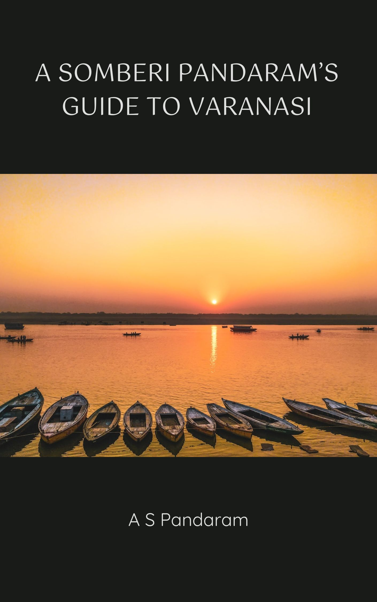
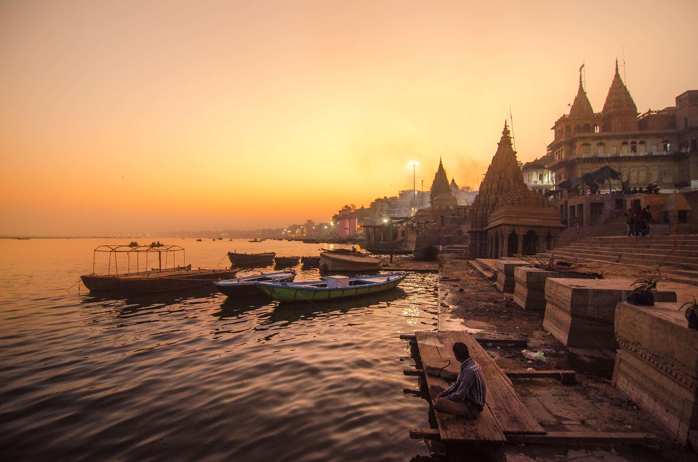
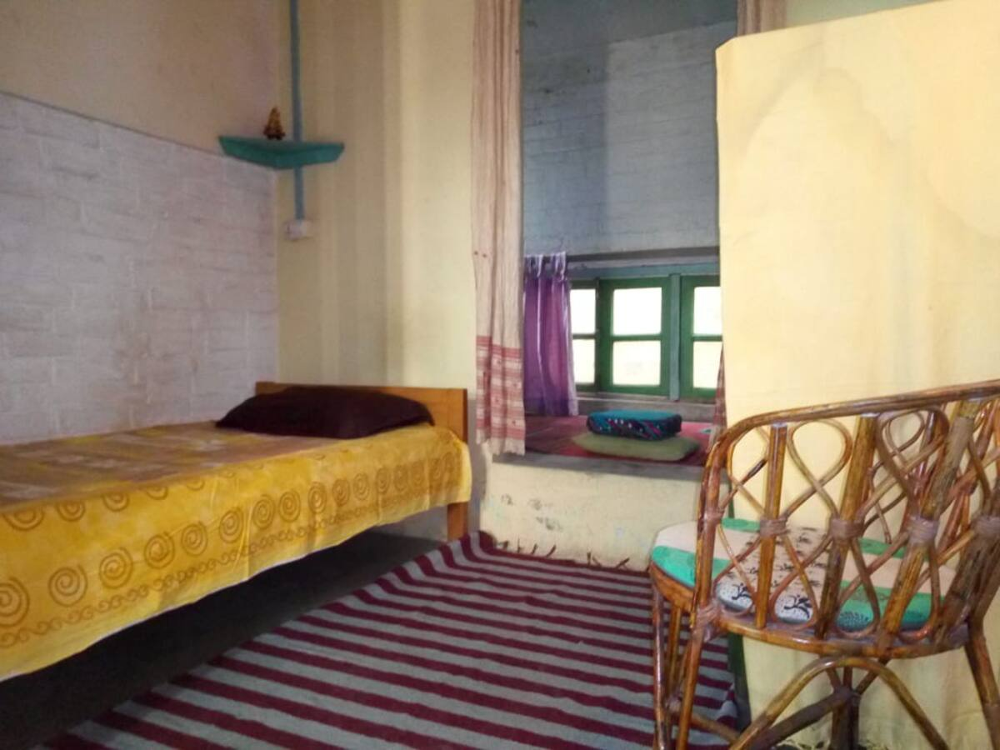
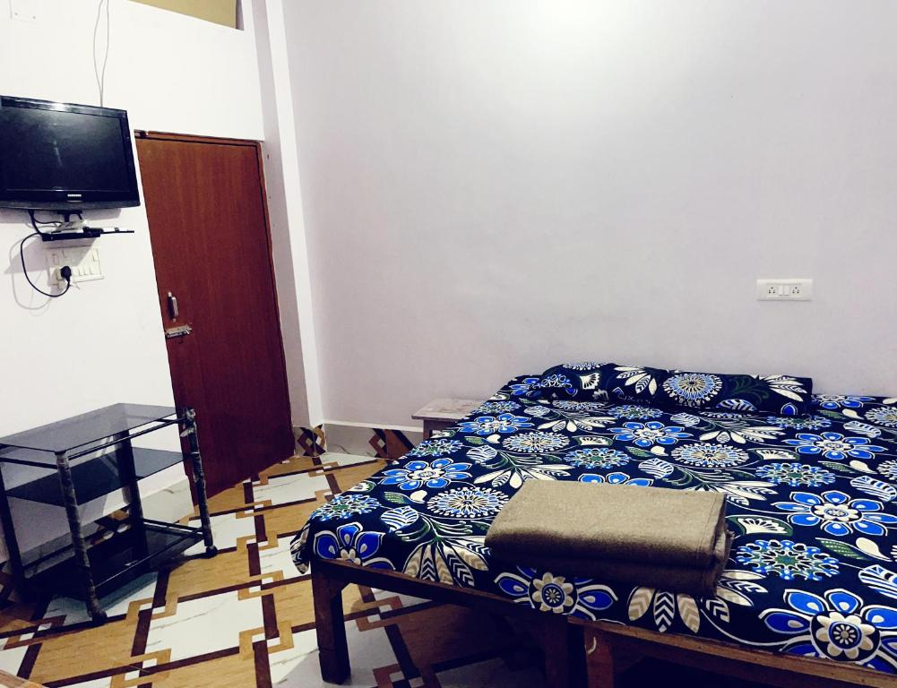
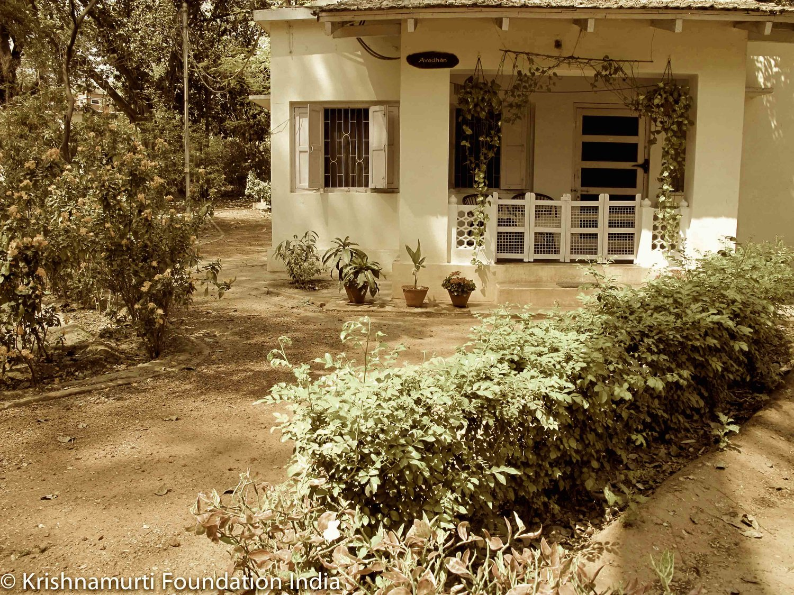

[separator=::]
= A _Somberi Pandaram's_ Guide to Varanasi
:author: A S Pandaram
:doctype: book
:leveloffset:
:front-cover-image: 
:sectnums:
:sectlinks:
:chapter-signifier:
:toc: left
:toclevels: 4
:imagesdir: ./

== Introduction
* The purpose of this document is to provide a basic guide to Varanasi - for the average, no-nonsense, thrifty South-Indian _Tamizh-magan_ !
* A minimalist, essentialist approach has been followed.
* This guide is based on a trip taken by the author to Varanasi during the fag end of 2023, so it's possible that many of the recommendations given here are already outdated / irrelevant by now, so kindly take them with a grain of salt ! The approach for planning a trip however, should remain more or less the same. 

== Getting there
* Varanasi is well connected by flights and railways.
* Regarding railways : 
** There's the well-known _Ganga Kaveri_ Express that operates twice a week which begins at Chennai Central (MAS) and terminates at Chhapra(CPR). Varanasi Junction (BSB) / Cantonment is the station where one needs to get down. 
** The total duration of the journey is ~40 hours.
** Once you get down at the Cantonment, you can get a shared autorickshaw to Godolia Chowk (near to Dashashwamedha Ghat), which should cost Rs ~20 per seat. Otherwise it's Rs ~100 one-way for a single person (non-share basis). 
* There are flights as well from Chennai / Bengaluru to Varanasi :
** Direct flight (few in number) : ~2.5 hours 
** Flight with intermediate stop : 3 to 6 hours
** Once you get down at the airport, you can get a shared auto-rickshaw to the city (Bhelupur area) for Rs ~250. Another way is to use the airport bus service (to the left, 50 to 100m after exiting the airport) which will take you to Varanasi Cantonment for Rs ~50. Cabs are also available to the city which are a bit more expensive (Rs ~500).

== Where to stay

=== Basic Guidelines

* If it's summer, it may be a good idea to look for a room with A/C. +
If it's winter, even a non-A/C room would do.
* It's better to book a room atleast a month in advance since hotel / guesthouse prices can change dynamically based on the demand and how soon you'll need it.
* Many of the hotels are notorious for charging a huge sum of money and offering very little in terms of basic facilities and comfort. 
* So it's always a good idea to do your due diligence / research and read user reviews, check photos as well as ratings well in advance before picking a place to stay.
* Check for the following before booking - 
** Hot water facility.
** Clean bedsheets / linen and blankets.
** Flexible / early check-in time, if possible, in case your flight / train arrives earlier than the standard norm (11:00 am).
** Provision to wash and hang one's clothes. Some hotels don't allow guests to do this, so it's good to check this or atleast see if there's a laundry facility nearby (which is usually affordable).
** If you prefer to cook your own food, and you happen to choose a homestay, it would be good to check if there's a kitchen that you can access for the same. 
** Generally, the area near Dashashwamedh Ghat is the "most happening / bustling place" and therefore, a densely populated zone. Assi Ghat is relatively less dense and more peaceful / quiet, but it's ~3 Km away from the former. 

=== Good websites to scout for places to stay

* Booking.com - http://www.booking.com[Website Link]
** This website allows you to book hotels and guesthouses online. Many budget-friendly options, so worth scouting around here.
** Many places don't require you to pay an advance amount for booking, but do check the cancellation policy carefully before picking a place.
* AirBnB - https://www.airbnb.co.in/[Website Link]
** Primarily a platform for renting a homestay - an arrangement where you live in somebody's apartment / home, usually occupying one room with access to common facilities like bathrooms, kitchen, washing machine, balcony etc.
** Works well if you're looking for a home away from home !
** You'll have to pay the entire rent advance up-front during the online booking process itself via Netbanking / UPI. 
** Please make a note of the cancellation policy before booking, some places a quite strict and there's a risk of losing your money in the event of cancellation. 
* Agoda - https://www.agoda.com/[Website Link]
** This is similar to Booking.com

=== Some recommendations

==== NIRMAN Vidyashram - The Southpoint School 

* https://www.airbnb.co.in/rooms/839786328829585810?source_impression_id=p3_1720537188_P3Fo-zcqQGPBqH3Y[Website Link]
* This is a progressive school run by an NGO for children, with a cozy guesthouse inside. 
* Located in Lanka, it's ~2Km from Assi Ghat, so roughly a half-hour journey by foot.
* The rooms are simple and adequate for a single person, with shared bathrooms (1 standalone shower + 1 shower and toilet + 1 standalone toilet),
* Breakfast is complementary.
* Very cheap (Rs ~700 per day) for long-term stays (atleast a week or so) !
* Good vegetarian restaurants are a bit far from here, the nearest one is https://www.google.com/maps/place/Bhagirathi+bhojanalaya/@25.2864868,83.0067338,15z/data=!4m2!3m1!1s0x0:0x49a3a5809e5037f6?sa=X&ved=1t:2428&ictx=111[Bhageerathi Bhojanalaya] which is ~1.5Km so you'll have to walk a bit (~15min) to have your lunch / dinner. 
* If you wish to book this place to stay, you'll have to pay the rent in advance during the booking itself via Netbanking / UPI. Please make a note of the cancellation policy as well before doing so. 

==== Chandrashram

* https://www.booking.com/hotel/in/chandrashram-paying-guest-house-varanasi.html[Website Link]
* This is an excellent budget-friendly and clean place (Rs ~900 per day) located close to the river bank at Assi Ghat.
* There are plenty of good eateries nearby, so not to worry.

==== Rajghat Study Centre, J Krishnamurti School

* https://www.rajghatbesantschool.org/jk/rajghat-study-centre/[Website Link]
* If you're looking for a quiet place for solitude and inner reflection, look no further !
* This place is simply beautiful and serene, meditation happens quite spontaneously.
* The room rent is Rs ~1200 per day and it includes 3 meals + 2 tea / coffee breaks. The rooms are all very spacious, comfortable, with attached bathrooms and other standard facilities like hot water, space for hanging clothes etc. 
* Caveat : you cannot use this place as a base for sight-seeing. If you plan to stay here, you must stay put for the entire duration from the check-in to check-out date ! 
* To book a cottage, you'll have to send a mail to the following email address stating your intended purpose (preferably inner contemplation / study) with date and duration of stay : studycentre@rajghatbesantschool.org

== Where to eat
* Most of the good (South-Indian-Vegetarian friendly) eateries are located near the Dashashwamedh Ghat. There are some good places to eat at Assi Ghat as well. 
* Scout for the "Bhojanalaya" (North-Indian Vegetarian) / "Udupi" (South-Indian Vegetarian) keywords amidst the restaurant notice boards on the streets, you can get a decent vegetarian meal that fills the belly for Rs 80 - Rs 100.
* The _Nattukottai Chettiar Chatram_ offers excellent Tamilian food 3 times a day, but you may have to purchase a coupon for the same each time. It's located near the Vishwanath Temple https://www.google.com/maps/place/Sri+Kasi+Nattukottai+Nagara+Chatram/@25.3080628,83.0068226,15z/data=!4m2!3m1!1s0x0:0x6ab9bb8c97c73567?sa=X&ved=1t:2428&ictx=111[here].
* There's a place near the Kasi Vishwanath Temple where they offer free meals, called https://www.google.com/maps/place/Anapurna+Free+Bojanam+Mess/@25.3110726,83.0107696,17z/data=!4m14!1m7!3m6!1s0x398e2e1e92f39d41:0x20010d1f429f6234!2sAnapurna+Free+Bojanam+Mess!8m2!3d25.3115962!4d83.01048!16s%2Fg%2F11c6rgy9hp!3m5!1s0x398e2e1e92f39d41:0x20010d1f429f6234!8m2!3d25.3115962!4d83.01048!16s%2Fg%2F11c6rgy9hp?entry=ttu[Annapurna Free Bhojanam Mess]. The lunch is South-Indian style and really good here. 
* The staple vegetable in Benaras is the potato, so watch out for it if you're conscious about what you're eating. The author of this document suffered much under the hands of this dreaded vegetable, with excessive farting / flatulence and general digestive discomfort ! 
* It might be a good idea to invest in a simple travel electric cooker (600W rating) and use it to cook your own meals then and there. 

== Where to go / What to do
Ideally, there is nothing to be done at Varanasi ! It's best to _Summa Iru_ (Be Still) as said by Bhagavan Sri Ramana Maharshi. However, there are a few things worth doing as well as places worth visiting to deepen one's experience of the ever-present inner stillness / silence. 

=== _Ganga Snanam_ (Purificatory dip at the Ganges)

* Take a dip at the Ganges early morning before visiting the Kasi Vishwanath Temple. https://maps.app.goo.gl/mdaMdx41y6ZsiVjx6[Dashashwamedh Ghat] is a good, clean place for this. 
* Sages of the past have often spoken about the purificatory benefits of taking a dip at Holy Ganga, so don't miss this !

=== _Ghat_ walk

* Walking along the _ghats_ of Varanasi is a very relaxing experience, especially during the wee hours of the morning.
* The cool wind, the rising sun, the stillness of _Ganga Mata_, the sounds of people chanting along with a refreshing cup of lemon _chai_ make for an altogether memorable experience !
* The stretch from _Assi Ghat_ to _Manikarnika Ghat_ is a ~40 minute walk. Be sure to visit _Harishchandra Ghat_ and _Manikarnika Ghat_ - they're the "burning _ghats_" of Varanasi, a humbling reminder of where we're ultimately headed for in this short life.

=== Kasi Vishwanath & Annapurna Temples
* Location : https://www.google.com/maps/place/kasi+viswanathar+temple+varanasi/data=!4m2!3m1!1s0x398e2e21ee940b17:0x48600e4fcdfb7b13?sa=X&ved=1t:155783&ictx=111[Link]
* It's good to visit these two temples ~7am in the morning (after a dip at the Ganges), it's usually not so crowded then.
* Mobile phones are strictly not allowed inside, but you can keep them inside a free locker facility located within the premises and collect them later.

=== Other temples / shrines worth visiting
* Kaal Bhairav Mandir : https://maps.app.goo.gl/Zgu4LDE4TgoFS3599[Link]
* Sri Anandamayi Ashram : https://maps.app.goo.gl/69MPPJAofps6QpBS7[Link]
* Sri Trailanga Swami's Samadhi : https://maps.app.goo.gl/kzgzsTtCSgW4VXj4A[Link]

=== Boat ride
* Try the boat ride from Raj Ghat to Assi Ghat (~30 mins), it's a bit expensive (Rs ~500 per head) but totally worth the experience !